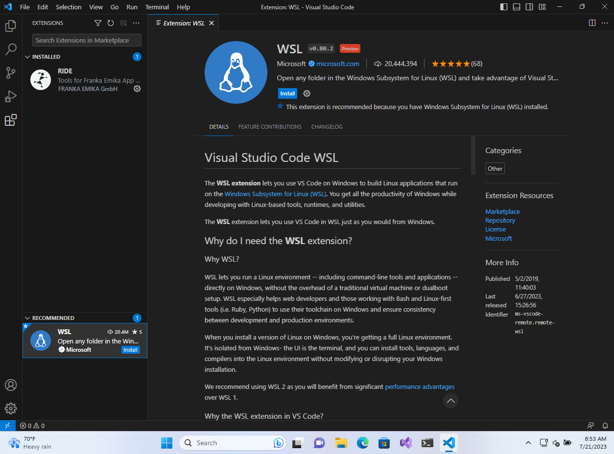
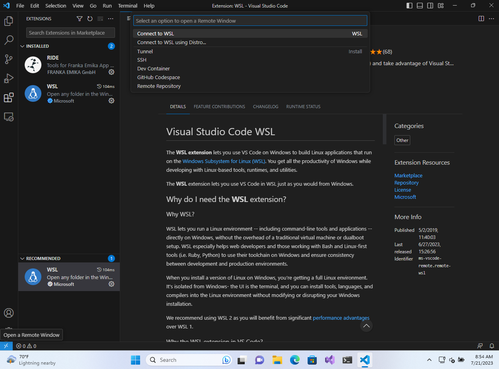
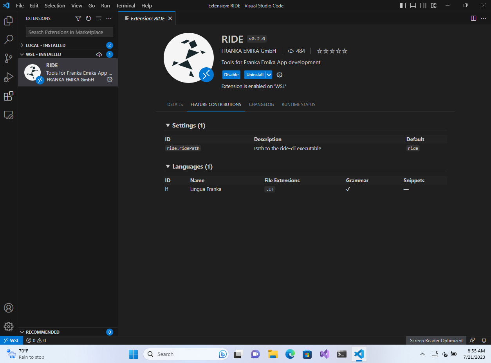

# ride-vscode

App development tools for Visual Studio Code.

## Features

The following features have been implemented:

* Syntax highlighting for `.lf` files, including Lua and context menu HTML blocks.
* Language Server support for `.lf` files
  * Diagnostics (lf syntax errors)
  * Jump to definition
  * List references
  * Show type definition of linked state machines
  * Auto completion
  * Integrated lua language server

## Requirements

* Visual Studio Code `1.80.1`.
* [ride-cli](https://franka.world/resources) `>= 0.9.0` for Language Server support.

## Install instructions for VSCode on Windows

At present, we do not offer a ride-cli package that directly runs on Windows. To use the language server which is built into the ride-cli executable you can leverage the WSL (Windows Subsystem for Linux).

1. Start with installing WSL and the ride-cli package by following the ride-cli documentation provided in the [Franka World Hub](https://franka.world/resources).
2. Install the Microsoft [WSL extension](https://marketplace.visualstudio.com/items?itemName=ms-vscode-remote.remote-wsl)

3. Connect to WSL: Press F1 to open the command palette and enter `Connect to WSL`

4. Install the [RIDE plugin](https://marketplace.visualstudio.com/items?itemName=FrankaEmika.ride-vscode) in the WSL environment.

5. Open your state machines / bundles in the WSL file system. Now you're ready to use the full features of this plugin on Windows.

Further information about developing in WSL can be found [here](https://code.visualstudio.com/docs/remote/wsl).

## License

`ride-vscode` is licensed under the [Apache 2.0 license][apache-2.0]

[apache-2.0]: https://www.apache.org/licenses/LICENSE-2.0.html
